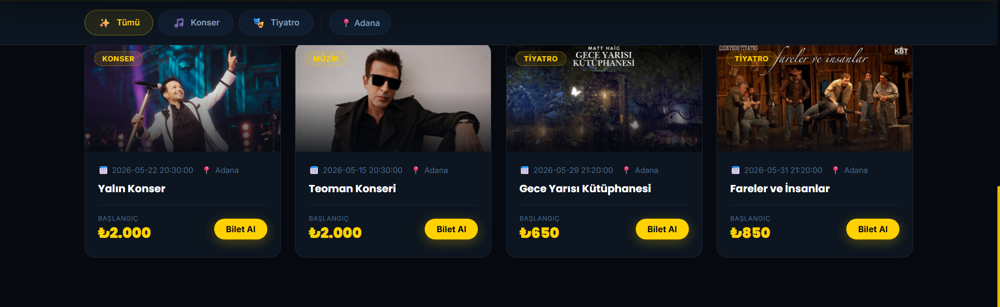
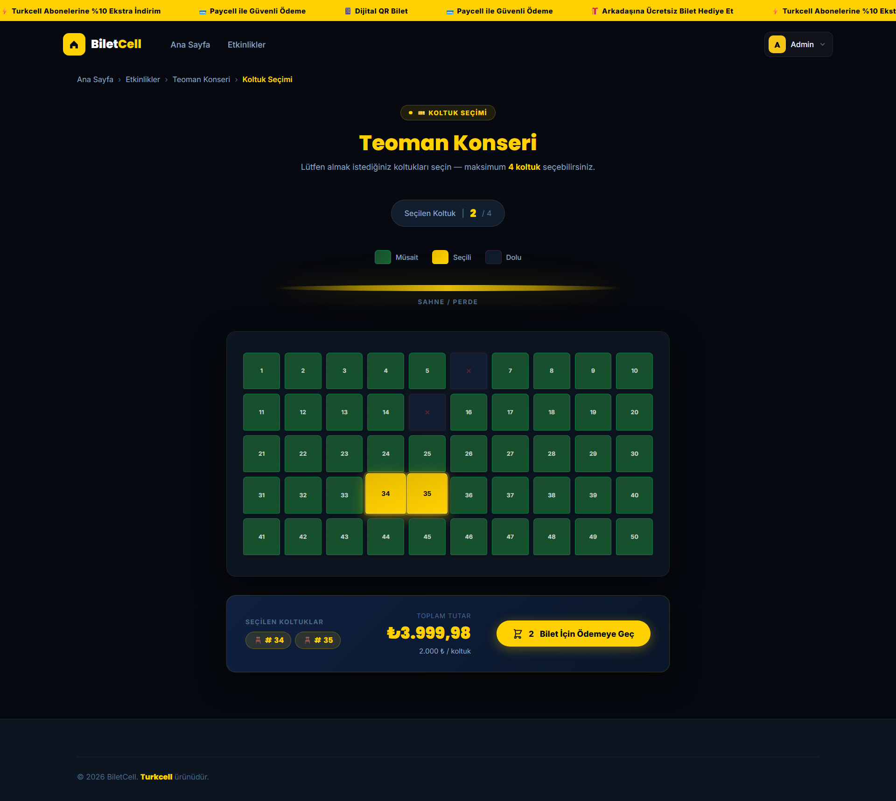
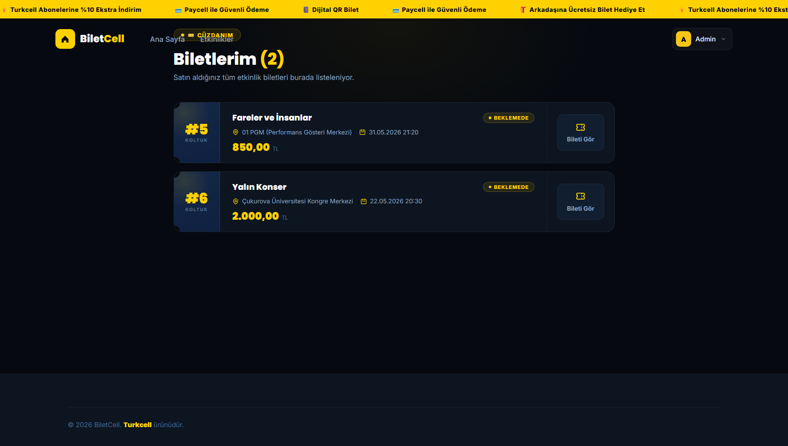
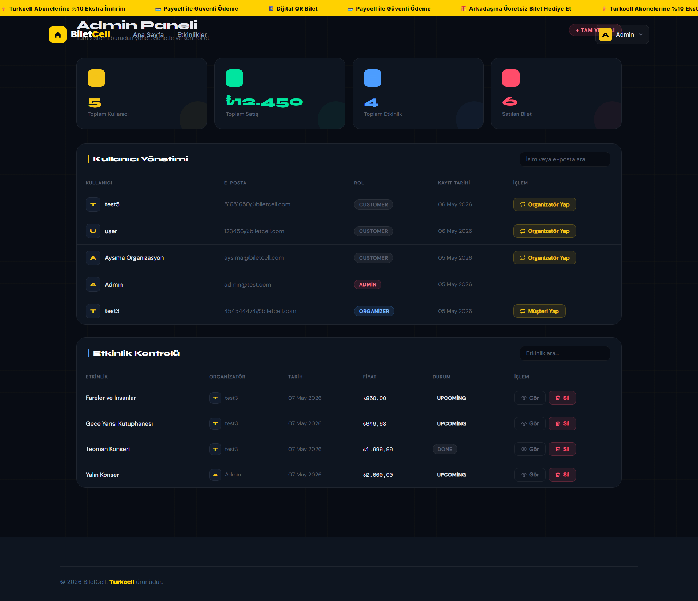
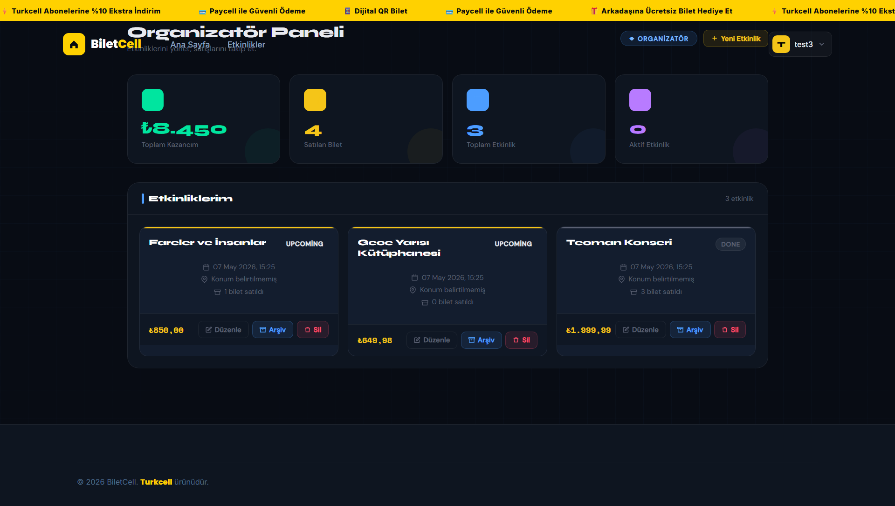

# 🎫 BiletCell - Event & Ticketing Platform

**Turkcell CodeNight 2026** - A modern full-stack ticketing platform where users can discover events, select interactive seats, and purchase digital tickets with QR code validation.

---
## 📸 Screenshots

### Core User Flow
<p align="center">
  
  
  
</p>

### Management Dashboards
<p align="center">
  
  
</p>

---

## 🚀 Key Features

### 👤 Authentication & User Roles
* **GSM-Based Login:** Fast registration via Turkcell GSM numbers and OTP (Simulation code: `1234`).
* **Role-Based Access Control (RBAC):**
    * **Admin:** User management, role assignment, and revenue tracking.
    * **Organizer:** Event creation, management, and earnings analytics.
    * **User:** Browsing events and purchasing tickets.
* **Custom Token Auth:** Secure session management for all API requests.

### 🎟️ Ticketing & Seat System
* **Interactive Seat Map:** Category-based seating with real-time status updates (Available / Selected / Sold).
* **Purchase Limits:** Maximum of 4 seats per transaction to ensure fair distribution.
* **Seat Locking:** Temporary reservation mechanism during the checkout process to prevent double-booking.
* **Digital QR Tickets:** Unique QR codes generated for each ticket after a successful purchase.

### 💳 Payment (Paycell Simulation)
* **Successful Test Card:** `4242-4242-4242-4242`
* **Failed Test Card:** `4000-0000-0000-0002`
* **Flow:** Complete checkout experience including card forms and transaction status feedback.

---

## 🛠️ Tech Stack

| Layer | Technology |
| :--- | :--- |
| **Backend** | Laravel 11 (PHP 8.3) |
| **Frontend** | Blade Templates + TailwindCSS |
| **Database** | MySQL (3NF Relational Schema) |
| **DevOps** | Docker & Docker Compose |
| **API Testing** | Thunder Client / Postman |

---

## ⚙️ Installation (Docker)

1.  **Clone the Repository:**
    ```bash
    git clone [https://github.com/Aysimacil/biletcell.git](https://github.com/Aysimacil/biletcell.git)
    cd biletcell
    ```

2.  **Environment Setup:**
    ```bash
    cp .env.example .env
    ```

3.  **Launch Containers:**
    ```bash
    docker-compose up -d --build
    ```

4.  **Database Migration & Seeding:**
    ```bash
    docker exec -it biletcell_app bash
    php artisan migrate --seed
    ```

---


* **Aysima:** Full Stack Development, Database Design & Docker Orchestration
